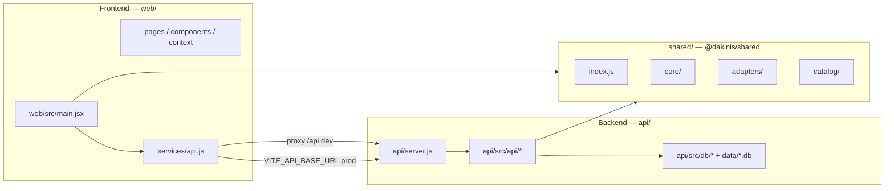

# Dakinis Modular Architecture

Arquitectura del producto **Dakinis One**: motor de módulos reutilizable + personalización por vertical + **API multi-tenant** (SQLite en MVP, migrable a PostgreSQL).

El repo está organizado en **tres carpetas** (`web/`, `api/`, `shared/`) más **npm workspaces** en la raíz (paquetes `@dakinis/web`, `@dakinis/api`, `@dakinis/shared`), para desplegar el SPA y la API por separado (por ejemplo dos servicios en Render).

## Monorepo y comandos

Instalación de dependencias (una vez, en la raíz): `npm install`.

| Comando | Acción |
|---------|--------|
| `npm run dev` | Vite en `web/` — workspace `@dakinis/web`; proxy `/api` → API local. |
| `npm run dev:full` | **Una terminal**: `concurrently` arranca API + Vite (mismo proxy que arriba). |
| `npm run preview` | Sirve `web/dist` con Vite preview (útil tras `npm run build`). |
| `npm run start:api` | Node — workspace `@dakinis/api`; ejecuta `api/server.js`. |
| `npm run build` | Build de producción del SPA → **`web/dist/`**. |
| `npm run lint` / `npm run lint:fix` | ESLint: `eslint.config.js`, `shared/`, `web/src`, `web/vite.config.js`, `api/` (incluye `server.js`). |
| `npm run format` / `npm run format:check` | Prettier sobre `shared/`, `web/`, `api/` y `eslint.config.js` (ver `.prettierignore`). |

Desarrollo local: **`npm run dev:full`** o **dos terminales** — `npm run start:api` y `npm run dev` — para que el proxy de Vite reenvíe `/api` al puerto de la API (`8787` por defecto, configurable con `PORT` y `VITE_DEV_API_PROXY` en `web/`). Si la API no está en marcha, el navegador puede devolver **502** en llamadas a `/api`.

## Frontend y backend (mapa)



### Backend (`api/`)

No forma parte del bundle de Vite. Arranque: `npm run start:api` (equivalente a `npm run start -w @dakinis/api`).

| Ruta | Rol |
|------|-----|
| `api/server.js` | HTTP: CORS (`CORS_ORIGIN` / `FRONTEND_URL`), rate limit, rutas `/api/*`, autenticación. **No** sirve el SPA. |
| `api/src/api/` | REST: `router`, `contracts`, `responses`, `security`, `auth-tenant`, `auth-routes`, `business-context`, `adapter-resolver`. |
| `api/src/db/` | SQLite: `schema.sql`, `seed.js`, `index.js` (inicialización y acceso). |
| `data/` (raíz del repo) | Base de datos por defecto `dakinis.db` (ruta absoluta/relativa vía `SQLITE_PATH`). |

### Frontend (`web/`)

Vite + React. Salida de build: `web/dist/` (ignorada en Git; ver `.gitignore`).

| Ruta | Rol |
|------|-----|
| `web/index.html`, `web/styles.css` | Shell del SPA y estilos globales. |
| `web/public/` | Estáticos en la raíz del sitio (`/…`), p. ej. logos. |
| `web/vite.config.js` | Proxy hacia la API en dev/preview; objetivo por defecto `http://127.0.0.1:8787`, sobrescribible con `VITE_DEV_API_PROXY` (ver `.env.example`). |
| `web/src/` | `App.jsx`, `pages/` (incl. `VistaMockupPage.jsx`), `mockups/` (maquetas estáticas por vertical), `components/`, `context/`, `services/api.js`, `data/systemPages.js`, `config/`. |

`VITE_API_BASE_URL`: **vacío** en local (rutas relativas `/api` + proxy). En producción, URL pública de la API **sin barra final**.

#### Rutas del SPA (`web/src/App.jsx`)

Resolución en este orden: `/login` → `/admin` → **`/vista/:vertical`** → **`/sistema/:vertical`** → inicio (`/`).

| Prefijo | Constante (`shared/catalog/routes.js`) | Uso |
|---------|----------------------------------------|-----|
| `/vista/` | `DAKINIS_VISTA_ROUTE_PREFIX` | **Mockups de panel** (solo presentación): componentes en `web/src/mockups/*`; no persisten datos ni sustituyen la demo funcional. |
| `/sistema/` | `DAKINIS_SYSTEM_ROUTE_PREFIX` | **Página de sistema** por vertical: formularios demo, listados tenant, supply, equipo, etc. |

Con **sesión JWT de tenant**, el cliente solo puede permanecer en la vertical de `business.type` (tanto en `/sistema/…` como en `/vista/…`). Los **platform_admin** no usan rutas de vertical de tenant; gestionan negocios vía `/admin` y API `/api/platform/*`.

### Paquete compartido (`shared/`)

**`@dakinis/shared`**: fábrica de módulos (`core/`), **adapters** por vertical (clínica, peluquería, restaurante, inmobiliaria), **catalog** (módulos de producto, registry, `business-mapping`, `routes`, `business-type-display`). Lo consumen el bundle del cliente y, en el servidor, `api/src/api/router.js` y `adapter-resolver.js` (import ESM `from "@dakinis/shared"`).

| Ruta | Rol |
|------|-----|
| `shared/index.js` | Exports: `dakinisCreatePlatformModules`, adapters, etc. |
| `shared/catalog/routes.js` | Prefijos de rutas cliente: `/sistema/`, `/vista/`, vertical por defecto. |
| `shared/package.json` | Mapa `exports` para subrutas del `catalog/` usadas desde `web/`. |

Solo capa presentación: p. ej. `web/src/config/public-defaults.js`; el catálogo de módulos se consume desde `@dakinis/shared` (sin duplicar mapas locales de verticales).

### Raíz del repositorio

| Archivo / carpeta | Rol |
|-------------------|-----|
| `package.json` | Workspaces: `shared`, `web`, `api` (nombres de paquete con prefijo `@dakinis/`). |
| `eslint.config.js` | ESLint 9 (flat config), React, Prettier. |
| `.prettierrc.json`, `.prettierignore` | Formato; exclusiones p. ej. `node_modules`, `dist`. |
| `.gitignore` | `node_modules/`, `web/dist/`, `data/*.db*`, `.env`, `.idea/`, `.vscode/`, cachés Vite, etc. |
| `.env.example` | Plantilla: API (`PORT`, `SQLITE_PATH`, `CORS_ORIGIN`) y build del front (`VITE_API_BASE_URL`, `VITE_DEV_API_PROXY`). **No** commitear `.env` real. |
| `render.yaml` | Blueprint de ejemplo (Static Site + Web Service); ajustar nombres y recursos. |
| `docker-compose.yml` | Postgres opcional para fases futuras; el MVP usa SQLite en `data/`. |

## Principios de diseño

- Configuración validada (`dakinisValidateConfig`) y módulos con responsabilidad única.
- Separación **motor** (`core` + factory) vs **vertical** (`adapters`) vs **tenant** (fila en `business` + datos en `tenant_*`).
- **Multi-tenant**: header `x-business-id` (slug o id); el tipo de negocio viene de `business.type` en SQLite.
- Autenticación: **JWT** (`POST /api/auth/login`, `GET /api/me`) o **x-api-key** (desarrollo / `tenant_api_keys`).

## Uso rápido (motor en código)

```js
import { dakinisCreatePlatformModules, dakinisClinicEstheticAdapter } from "@dakinis/shared";

const modules = dakinisCreatePlatformModules({
  ...dakinisClinicEstheticAdapter,
  dashboard: { currency: "EUR" }
});
```

## API y persistencia

| Pieza | Función |
|-------|---------|
| `api/server.js` | Inicializa DB (`dakinisInitDb`), rate limit, resolución de tenant, autenticación. |
| `api/src/api/router.js` | Monta módulos según `business.type` y `config_json`; `/api/config`, módulos, `GET/POST /api/tenant/mock-records`, tenant users, supply (`tenant-supply`), etc.; rutas plataforma en `platform-routes.js`. |
| `api/src/api/auth-routes.js` | `POST /api/auth/login`, `GET /api/me` (vía `server.js`). |
| `api/src/db/schema.sql` | `business`, `users`, `tenant_api_keys`, `tenant_records`. |

Contrato de respuestas: `ok`, `data`, `meta` — ver `api/src/api/contracts.js` y `responses.js`.

## Capas del sistema (lectura rápida)

- **Presentación**: `web/src/*` (más `web/public/`, estilos y Vite).
- **Dominio compartido**: paquete `@dakinis/shared` (`core`, `adapters`, `catalog`).
- **Infraestructura API y datos**: `api/server.js`, `api/src/api/*`, `api/src/db/*`, fichero SQLite bajo `data/`.

## Despliegue en Render (resumen)

1. **API** (Web Service, Node): directorio raíz del repo; `npm ci`; comando de arranque `npm run start -w @dakinis/api`. Definir `CORS_ORIGIN` con la URL del front. Para SQLite en producción: **disco persistente** y `SQLITE_PATH` apuntando al volumen (p. ej. `/var/data/dakinis.db`).
2. **Frontend** (Static Site o equivalente): `npm ci && npm run build -w @dakinis/web`; publicar **`web/dist`**. Variables de build: **`VITE_API_BASE_URL`** = URL HTTPS de la API (sin `/` final).

Más detalle en `.env.example` y comentarios en `render.yaml`.

## Calidad de código

| Comando | Uso |
|---------|-----|
| `npm run lint` | ESLint en workspaces y config raíz. |
| `npm run format` | Escribir formato Prettier. |
| `npm run format:check` | CI: falla si el formato no coincide. |

Antes de commit o PR: `npm run lint && npm run format:check && npm run build`.

## Referencias

- Producto y roadmap: `ESTRUCTURA.md`.
- Endpoints y ejemplos: `API_READY.md`.
- Variables de entorno: `.env.example`.
