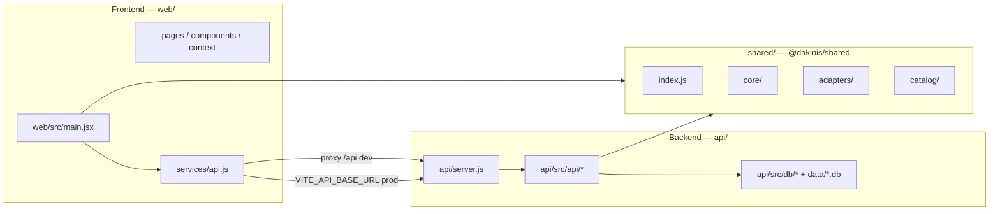

# Dakinis — Arquitectura

Documento único: **estructura del repo**, **cómo encaja el producto**, **posicionamiento y modelo de negocio**, **multi-tenant, seguridad, observabilidad e integraciones**, y **camino hacia SaaS**. Detalle de endpoints en `API_READY.md`; variables en `.env.example`.

## Producto y visión

**Dakinis One** (Scheduler + CRM + WhatsApp en la UI) apunta a un **SaaS multi-tenant**: varios negocios aislados, cada uno con panel propio, datos separados y configuración por plan.

No es solo una demo de scheduler: el valor está en **encajar con flujos reales** (clínica, peluquería/barbería, restaurante, inmobiliaria).

### Estado actual vs objetivo SaaS

| Aspecto | Hoy en el repo | Objetivo SaaS |
|--------|----------------|---------------|
| Identidad del negocio | Tabla `business` (id, slug, `type`); resolución por **`x-business-id`** (id o slug). | Mismo modelo ampliado: facturación, límites por plan, más campos operativos. |
| Aislamiento de datos | SQLite: `tenant_records`, supply, usuarios por `business_id`; parte de la UI sigue siendo **mock en memoria**. | PostgreSQL (u otro) con **`business_id` en todas** las tablas de dominio; CRUD real end-to-end. |
| API | JWT (`/api/auth/login`, `/api/me`), **x-api-key**, validación tenant/plataforma; router por `business.type`. | Refinar autorización, auditoría, rate limits por plan. |
| Autenticación | Email/password + JWT; rol `platform_admin` + API `/api/platform/*`; TOTP opcional para plataforma. | 2FA más amplio, invitaciones, roles finos si hace falta. |
| Producto en UI | Rutas `/sistema/:vertical`, mockups `/vista/`, merge de config remota. | Dashboard con datos persistidos, métricas por tenant, módulos activables por plan. |

## Posicionamiento

**Dakinis One** no es un CRM genérico ni un SaaS rígido: es un **sistema modular** orientado a operativa real (citas, clientes, pedidos, leads, mensajería), con **configuración por tipo de negocio** (vertical) y **aislamiento por tenant**. El valor comercial está en encajar el producto con el flujo del cliente y desplegar rápido, no en reemplazar toda su stack el día uno.

## Modelo de negocio (propuesta SaaS)

Propuesta orientada a venta B2B: **precio por tenant** (negocio) con variables de uso y upsells. Los nombres de plan son orientativos; en código hoy existe el campo `business.plan` como ancla evolutiva.

| Plan (propuesta) | Incluye (resumen) |
|------------------|-------------------|
| **Starter** | 1 usuario administrador (o pocos), módulos básicos (p. ej. agenda + registro mínimo de clientes), límites de volumen bajos. |
| **Growth** | Más usuarios, **CRM** (pipeline, segmentación ligera), automatizaciones sencillas (recordatorios, reglas básicas). |
| **Pro** | **WhatsApp** (cuando exista integración real), **analytics** por tenant, integraciones estándar (calendario, email transaccional), límites ampliados. |

**Variables de precio (facturación futura):**

- Número de usuarios con acceso al panel.
- Volumen: citas, leads, mensajes o registros mensuales (según vertical).
- Módulos activos y nivel de automatización.
- Uso de APIs externas medibles (WhatsApp, SMS, otros conectores con coste marginal).

**Upsells (one-time o recurrente):**

- Setup inicial (configuración, migración desde hoja de cálculo o herramienta previa).
- Integraciones personalizadas (ERP, pasarela de pago del cliente, webhooks).
- Soporte premium (SLA, canal dedicado, horas de evolución mensuales).

Conectar estos bloques con el roadmap (planes en DB, Stripe, límites por módulo) mantiene alineados **precio**, **producto** y **ingeniería**.

## Onboarding de negocio (funnel comercial)

Flujo objetivo desde cierre comercial hasta primer valor en panel (hoy parcialmente cubierto por seed y `POST /api/platform/businesses`; a completar en producto):

1. **Crear** el registro `business` (slug único, `type` / vertical, `plan`).
2. **Seleccionar vertical** (o plantilla) y generar **config inicial** (`config_json` + defaults del adapter en `@dakinis/shared`).
3. **Crear usuario admin** del tenant (invitación por email o contraseña inicial segura).
4. **Primer acceso** al panel (`/sistema/:vertical` o URL futura `/app/...`) con checklist guiado (datos mínimos, canal WhatsApp opcional, etc.).

Este onboarding es el **puente entre ventas y retención**: cuanto más reproducible y medible, más escalable es el negocio.

## Monorepo y comandos

El repo está en **tres carpetas** (`web/`, `api/`, `shared/`) y **npm workspaces** (`@dakinis/web`, `@dakinis/api`, `@dakinis/shared`), para desplegar SPA y API por separado (p. ej. dos servicios en Render).

Instalación (una vez, en la raíz): `npm install`.

| Comando | Acción |
|---------|--------|
| `npm run dev` | Vite en `web/` — workspace `@dakinis/web`; proxy `/api` → API local. |
| `npm run dev:full` | **Una terminal**: `concurrently` arranca API + Vite (mismo proxy que arriba). |
| `npm run preview` | Sirve `web/dist` con Vite preview (útil tras `npm run build`). |
| `npm run start:api` | Node — workspace `@dakinis/api`; ejecuta `api/server.js`. |
| `npm run build` | Build de producción del SPA → **`web/dist/`**. |
| `npm run lint` / `npm run lint:fix` | ESLint: `eslint.config.js`, `shared/`, `web/src`, `web/vite.config.js`, `api/` (incluye `server.js`). |
| `npm run format` / `npm run format:check` | Prettier sobre `shared/`, `web/`, `api/` y `eslint.config.js` (ver `.prettierignore`). |

Desarrollo local: **`npm run dev:full`** o **dos terminales** — `npm run start:api` y `npm run dev` — para que el proxy de Vite reenvíe `/api` al puerto de la API (`8787` por defecto, configurable con `PORT` y `VITE_DEV_API_PROXY` en `web/`). Si la API no está en marcha, el navegador puede devolver **502** en llamadas a `/api`.

## Frontend y backend (mapa)



### Backend (`api/`)

No forma parte del bundle de Vite. Arranque: `npm run start:api` (equivalente a `npm run start -w @dakinis/api`).

| Ruta | Rol |
|------|-----|
| `api/server.js` | HTTP: CORS (`CORS_ORIGIN` / `FRONTEND_URL`), rate limit, rutas `/api/*` (incl. plataforma en `server.js` + `platform-routes.js`), JWT (`jwt-config` valida secreto en producción), autenticación tenant y `platform-auth`. **No** sirve el SPA. |
| `api/src/api/` | REST: `router`, `contracts`, `responses`, `security`, `jwt-config`, `auth-tenant`, `auth-routes`, `business-context`, `adapter-resolver`, `platform-auth`, `platform-routes`, `tenant-users`, `tenant-supply`. |
| `api/src/db/` | SQLite: `schema.sql`, `seed.js`, `index.js` (inicialización y acceso). |
| `data/` (raíz del repo) | Base de datos por defecto `dakinis.db` (ruta absoluta/relativa vía `SQLITE_PATH`). |

### Frontend (`web/`)

Vite + React. Salida de build: `web/dist/` (ignorada en Git; ver `.gitignore`).

| Ruta | Rol |
|------|-----|
| `web/index.html`, `web/styles.css` | Shell del SPA y estilos globales. |
| `web/public/` | Estáticos en la raíz del sitio (`/…`), p. ej. logos. |
| `web/vite.config.js` | Proxy hacia la API en dev/preview; objetivo por defecto `http://127.0.0.1:8787`, sobrescribible con `VITE_DEV_API_PROXY` (ver `.env.example`). |
| `web/src/` | `App.jsx`, `pages/` (incl. `VistaMockupPage.jsx`), `mockups/` (maquetas estáticas por vertical), `components/`, `context/`, `services/api.js`, `data/systemPages.js`, `config/`. |

`VITE_API_BASE_URL`: **vacío** en local (rutas relativas `/api` + proxy). En producción, URL pública de la API **sin barra final**.

#### Rutas del SPA (`web/src/App.jsx`)

Resolución en este orden: `/login` → `/admin` → **`/vista/:vertical`** → **`/sistema/:vertical`** → inicio (`/`).

Sin `react-router`: `window.location.pathname`, **`history.pushState`** / `popstate`.

| Prefijo | Constante (`shared/catalog/routes.js`) | Uso |
|---------|----------------------------------------|-----|
| `/vista/` | `DAKINIS_VISTA_ROUTE_PREFIX` | **Mockups de panel** (solo presentación): componentes en `web/src/mockups/*`; no persisten datos ni sustituyen la demo funcional. |
| `/sistema/` | `DAKINIS_SYSTEM_ROUTE_PREFIX` | **Página de sistema** por vertical: formularios demo, listados tenant, supply, equipo, etc. |

Con **sesión JWT de tenant**, el cliente solo puede permanecer en la vertical de `business.type` (tanto en `/sistema/…` como en `/vista/…`). Los **platform_admin** no usan rutas de vertical de tenant; gestionan negocios vía `/admin` y API `/api/platform/*`.

##### Accesos UI a mockups (`/vista/:vertical`)

- **Tenant:** además del bloqueo de vertical en `App.jsx`, el mockup propio se abre desde la barra (`AppTopBar.jsx` → `/vista/{business.type}`), el inicio (`HomePage.jsx`) y el panel funcional (`SystemPage.jsx` → enlace a la vista previa).
- **`platform_admin`:** `App.jsx` redirige `/sistema/…` a `/admin` (no operan datos de tenant por esa ruta). Pueden abrir cualquier `/vista/:vertical` (inicio, `PlatformAdminPage.jsx`, o URL directa) para revisar maquetas sin mezclar verticales en `/sistema`.

**Nota SaaS:** en el futuro la URL podría evolucionar a `/app/<business_id>` o `/b/<slug>`; el **tipo** de vertical seguiría siendo metadato del negocio, no el único identificador.

### Paquete compartido (`shared/`)

**`@dakinis/shared`**: motor de módulos (`core/`) — `agenda`, `booking`, `crm`, `whatsapp`, `leads`, `dashboard` — **adapters** por vertical (`clinic-esthetic`, `barbershop-premium`, `restaurante`, `real-estate`), **catalog** (`system-registry`, `system-modules`, `business-mapping`, `routes`, `business-type-display`). Lo consumen el cliente y, en el servidor, `api/src/api/router.js` y `adapter-resolver.js` (`from "@dakinis/shared"`).

| Ruta | Rol |
|------|-----|
| `shared/index.js` | Exports: `dakinisCreatePlatformModules`, adapters, etc. |
| `shared/catalog/routes.js` | Prefijos de rutas cliente: `/sistema/`, `/vista/`, vertical por defecto. |
| `shared/package.json` | Mapa `exports` para subrutas del `catalog/` usadas desde `web/`. |

Presentación local: p. ej. `web/src/config/public-defaults.js`; el catálogo de módulos viene de `@dakinis/shared`.

### Raíz del repositorio

| Archivo / carpeta | Rol |
|-------------------|-----|
| `package.json` | Workspaces: `shared`, `web`, `api` (nombres de paquete con prefijo `@dakinis/`). |
| `eslint.config.js` | ESLint 9 (flat config), React, Prettier. |
| `.prettierrc.json`, `.prettierignore` | Formato; exclusiones p. ej. `node_modules`, `dist`. |
| `.gitignore` | `node_modules/`, `web/dist/`, `data/*.db*`, `.env`, `.idea/`, `.vscode/`, cachés Vite, etc. |
| `.env.example` | Plantilla: API (`PORT`, `SQLITE_PATH`, `CORS_ORIGIN`, `JWT_SECRET`, `DAKINIS_PLATFORM_TOTP_SECRET` opcional) y build del front (`VITE_API_BASE_URL`, `VITE_DEV_API_PROXY`). **No** commitear `.env` real. |
| `render.yaml` | Blueprint de ejemplo (Static Site + Web Service); ajustar nombres y recursos. |
| `docker-compose.yml` | Postgres opcional para fases futuras; el MVP usa SQLite en `data/`. |

## Multi-tenant (concepto y reglas)

- **`business_id`** (UUID en DB; **slug** legible opcional en URLs y header) identifica al tenant.
- Headers típicos: `Authorization: Bearer <JWT>` y/o `x-api-key`, más **`x-business-id`** cuando la ruta lo exige; **`x-business-type`** debe ser coherente con el negocio resuelto (ver `contracts.js` y `router.js`).
- **Regla de oro:** toda lectura/escritura de datos de negocio debe filtrar por el negocio autorizado; no confiar solo en el front.

### Evolución del aislamiento multi-tenant

| Fase | Modelo | Cuándo tiene sentido |
|------|--------|----------------------|
| **Actual (MVP)** | Una base de datos compartida + **aislamiento lógico** por `business_id` (y slug en headers). | Inicio del producto, demos, primeros clientes; coste operativo bajo. |
| **Escala media** | Misma filosofía en **PostgreSQL**; particiones, índices por tenant, políticas estrictas en API. | Muchos tenants con volumen moderado; auditoría y backup centralizados. |
| **Opción avanzada** | **Schema por tenant** en la misma instancia (aislamiento físico parcial de tablas). | Clientes regulados o requisitos de segregación sin llegar a DB dedicada. |
| **Enterprise** | **Base de datos dedicada** por tenant (o por grupo de tenants). | Contratos enterprise, data residency o aislamiento contractual fuerte. |

La **estrategia inicial** del repo es aislamiento lógico por `business_id` validado en **backend**. La **estrategia futura** es migrar hacia mayor aislamiento físico solo cuando el volumen o el contrato del cliente lo exijan (evitar complejidad prematura).

## Persistencia

**Hoy (SQLite):** `business`, `users`, `tenant_api_keys`, `tenant_records`, tablas de supply, etc. (`schema.sql`). Rutas como `GET/POST /api/tenant/mock-records` apoyan demos.

**Objetivo:** PostgreSQL (u otro) con el mismo patrón `business_id`; tablas de dominio (citas, clientes finales del negocio, leads, logs de mensajes…) siguiendo ese esquema.

Los **mockups** en React pueden seguir existiendo para UX; la fuente de verdad para producto vendible es la **API + DB por tenant**.

## Autenticación (resumen)

| Mecanismo | Uso |
|-----------|-----|
| **JWT** | `POST /api/auth/login`, `GET /api/me`; sesión en el SPA para tenants y flujos autorizados. |
| **x-api-key** | Claves en `tenant_api_keys` (roles full-access / read-only). |
| **Plataforma** | Usuarios `platform_admin`; rutas `/api/platform/*` con `platform-auth` y TOTP opcional (`DAKINIS_PLATFORM_TOTP_SECRET`). |

**Evolutivo:** pagos (Stripe), planes, límites; WhatsApp real (Meta) cuando los datos por tenant estén sólidos.

## Seguridad (formal)

Principios que deben mantenerse al evolucionar el código; el **aislamiento de datos se garantiza en el backend**, no en el SPA.

| Área | Hoy / objetivo cercano |
|------|-------------------------|
| **Contraseñas** | Hash con **bcrypt** en seed y flujos de usuario (`api/src/db`); valorar **argon2** en endurecimiento futuro. |
| **Sesión** | JWT en cliente; **evolutivo:** expiración corta + **refresh tokens** rotativos, revocación en logout/compromiso. |
| **Abuso** | Rate limiting global en `api/server.js`; **evolutivo:** límites por tenant / por API key. |
| **Contexto tenant** | Validación estricta de **`x-business-id`** (y coherencia con JWT / negocio resuelto) en rutas tenant — ver `business-context`, `contracts`, `router`. |
| **Inyección SQL** | Consultas parametrizadas (`better-sqlite3` con binds); no concatenar SQL con entrada de usuario. |
| **XSS** | React escapa por defecto; evitar `dangerouslySetInnerHTML` con datos no confiables. |
| **CSRF** | API pensada para **cliente SPA + Bearer**: el riesgo CSRF clásico de cookies de sesión es menor; si se introducen cookies de sesión, añadir protección explícita (SameSite, tokens CSRF). |
| **Plataforma** | TOTP opcional para `platform_admin` (`DAKINIS_PLATFORM_TOTP_SECRET`). |

Cualquier nueva ruta que lea o escriba datos de negocio debe repetir el patrón: **autenticar → resolver `business_id` autorizado → filtrar query por ese id**.

## Principios de diseño

- Configuración validada (`dakinisValidateConfig`) y módulos con responsabilidad única.
- Separación **motor** (`core` + factory) vs **vertical** (`adapters`) vs **tenant** (fila en `business` + datos en `tenant_*`).
- Contrato de respuestas API: `ok`, `data`, `meta` — `api/src/api/contracts.js` y `responses.js`.

## Sistema de módulos (producto y técnico)

El motor en `@dakinis/shared` ya define módulos (`agenda`, `crm`, `whatsapp`, etc.). A nivel **producto vendible** falta formalizar en datos y API:

| Concepto | Descripción |
|----------|-------------|
| **Activación por plan** | Qué módulos incluye `Starter` / `Growth` / `Pro` (tabla de mapeo plan → módulos en DB o config). |
| **Configuración por tenant** | `config_json` por `business` + overrides respetando límites del plan. |
| **Dependencias** | Reglas del tipo: CRM avanzado requiere base de agenda; WhatsApp requiere identidad de negocio y preferiblemente CRM mínimo. |
| **Feature flags** | Activar betas por tenant o por porcentaje sin redeploy del front (lectura desde API `/api/config` o servicio de flags). |

Ejemplo de dependencias comerciales (orientativo): **agenda** (base) → **crm** → **whatsapp** (cuando exista canal real). La implementación puede ser un grafo validado al cambiar de plan o al guardar `config_json`.

## Uso rápido (motor en código)

```js
import { dakinisCreatePlatformModules, dakinisClinicEstheticAdapter } from "@dakinis/shared";

const modules = dakinisCreatePlatformModules({
  ...dakinisClinicEstheticAdapter,
  dashboard: { currency: "EUR" }
});
```

## API y persistencia (piezas)

| Pieza | Función |
|-------|---------|
| `api/server.js` | Inicializa DB (`dakinisInitDb`), `dakinisAssertProductionJwtSecret`, rate limit, resolución de tenant, autenticación; despacha rutas `/api/platform/*` y otras antes del router genérico. |
| `api/src/api/router.js` | Monta módulos según `business.type` y `config_json`; `/api/config`, módulos, `GET/POST /api/tenant/mock-records`, tenant users (`tenant-users.js`), supply (`tenant-supply.js`). Las rutas `/api/platform/*` se implementan en `platform-routes.js` y se enlazan desde `server.js`. |
| `api/src/api/auth-routes.js` | `POST /api/auth/login`, `GET /api/me` (vía `server.js`). |
| `api/src/db/schema.sql` | `business`, `users`, `tenant_api_keys`, `tenant_records`, `tenant_supply_deliveries`, `tenant_supply_alerts`. |

## Capas del sistema (lectura rápida)

- **Presentación**: `web/src/*` (más `web/public/`, estilos y Vite).
- **Dominio compartido**: `@dakinis/shared` (`core`, `adapters`, `catalog`).
- **Infraestructura API y datos**: `api/server.js`, `api/src/api/*`, `api/src/db/*`, SQLite bajo `data/`.

## Observabilidad y métricas

Estado **mayormente pendiente** a nivel producto; necesario para operar como SaaS serio.

| Pieza | Objetivo |
|-------|----------|
| **Logs estructurados** | JSON con `request_id`, `business_id` (cuando aplique), ruta, duración, código HTTP; correlación front (opcional header) ↔ API. |
| **Métricas** | Requests por tenant, latencia p95/p99, ratio de errores 5xx, uso por módulo (contadores en router o middleware). |
| **Alertas (futuro)** | Umbrales sobre error rate, saturación de CPU/memoria, colas, fallos de integración externa (WhatsApp, email). |
| **Trazas** | OpenTelemetry o equivalente cuando haya más de un servicio. |

Sin observabilidad, no hay base fiable para **SLA**, facturación por uso ni depuración en producción.

## Integraciones externas (roadmap de producto)

Formalizar dependencias de terceros desacopla el core y aclara costes marginales al cliente.

| Integración | Uso en Dakinis One | Notas |
|-------------|-------------------|--------|
| **WhatsApp (Meta Cloud API)** | Notificaciones, conversación con CRM, opt-in por cliente final. | Requiere número de negocio verificado, plantillas, cumplimiento de políticas Meta. |
| **Email** | SMTP propio, **SendGrid** / **Resend** / similar para transaccional y onboarding. | Baja fricción para MVP de notificaciones. |
| **Pagos** | **Stripe** (Checkout, Customer Portal, webhooks) para suscripción por plan y extras. | Conectar `business` ↔ `stripe_customer_id` / `subscription_id`. |
| **Calendarios** | **Google Calendar** / Microsoft Graph para sincronización de citas. | OAuth por tenant o por usuario según modelo de consentimiento. |

El UI ya anticipa WhatsApp en la propuesta de valor; la **persistencia y envío reales** viven en fases posteriores del roadmap (véase tabla de fases más abajo).

## Casos de uso por vertical (referencia de roadmap)

- **Clínica:** citas por recurso, recordatorios, historial y segmentación.
- **Peluquería / barbería:** agenda por profesional, reservas, recurrencia.
- **Inmobiliaria:** leads, visitas agendadas, embudo por fuente/agente.

## Riesgos técnicos conocidos

Transparencia ante cliente o inversor; mitigación planificada en roadmap.

| Riesgo | Impacto | Mitigación |
|--------|---------|------------|
| **SQLite y concurrencia** | Cuellos de botella con muchas escrituras concurrentes. | Migración a PostgreSQL; conexiones pool; diseño de escrituras. |
| **Dependencia de headers (`x-business-id`)** | Error de cliente o bug puede apuntar al tenant equivocado si el servidor no valida siempre contra el JWT. | Regla única de resolución en `business-context`; tests de integración por ruta. |
| **Mockups vs persistencia** | `/vista/` y parte de la UI no sustituyen datos reales; expectativas mal alineadas. | Documentar en UI y contrato comercial; converger features críticas a API+DB. |
| **JWT sin refresh (hoy)** | Ventana de compromiso larga si el token filtra. | Introducir refresh tokens y expiración acotada. |
| **Monolito SPA + API** | Escala vertical hasta cierto punto. | API stateless + horizontal scaling cuando haga falta; CDN para estáticos. |

## Estrategia de crecimiento (go-to-market técnico)

Enfoque recomendado para validar negocio sin dispersar el producto:

1. **Dominar una vertical** (p. ej. peluquería / barbería premium): mismo motor `shared`, adapter y flujos cerrados con clientes reales.
2. **Medir** retención, tickets de soporte y tiempo de onboarding antes de ampliar alcance.
3. **Reutilizar módulos** (`agenda`, `crm`, …) en nuevas verticales con nuevos adapters y presets de `config_json`, no reescribir el core.

Este orden reduce riesgo técnico y comercial frente a intentar cuatro verticales a profundidad simultánea sin tracción.

## Roadmap técnico (orientado a venta)

| Fase | Contenido |
|------|------------|
| **1 — Actual** | Monorepo, SQLite multi-tenant base, JWT + plataforma, adapters, mockups + sistema por vertical, API modular. |
| **2** | PostgreSQL, modelo de dominio amplio con **`business_id`**, CRUD persistido y aislado. |
| **3** | Profundizar auth (invitaciones, roles), observabilidad. |
| **4** | Pagos (ej. Stripe), planes, límites. |
| **5** | WhatsApp real (Meta), automatizaciones sobre datos por tenant. |

## Deuda y próximos pasos

- **`App.jsx` concentra** rutas, sesión y navegación manual; al crecer el producto conviene extraer **router** declarativo y trocear por dominio (`services/`, hooks, bloques por módulo).
- Sustituir progresivamente **mocks en memoria** por datos que vivan en API + DB con filtro por tenant.
- Catálogo evolutivo: de verticales fijas a **módulos activables por plan** (`agenda`, `crm`, `whatsapp`…) con presets por `business.type`.

## Despliegue en Render (resumen)

1. **API** (Web Service, Node): directorio raíz del repo; `npm ci`; comando `npm run start -w @dakinis/api`. Definir `CORS_ORIGIN` con la URL del front. SQLite en producción: **disco persistente** y `SQLITE_PATH` en el volumen (p. ej. `/var/data/dakinis.db`).
2. **Frontend** (Static Site o equivalente): `npm ci && npm run build -w @dakinis/web`; publicar **`web/dist`**. Build: **`VITE_API_BASE_URL`** = URL HTTPS de la API (sin `/` final).

Más detalle en `.env.example` y comentarios en `render.yaml`.

### Escalabilidad operativa (visión)

| Capa | Evolución |
|------|-----------|
| **API** | Procesos **stateless** detrás de balanceador; varias instancias Node con la misma base de datos (o read replicas en Postgres). |
| **Frontend** | **CDN** para `web/dist` (estáticos); cache busting por hash de assets (Vite ya emite nombres con hash). |
| **Datos calientes** | **Redis** (u otro) para sesiones, rate limits por tenant, cache de config si el tráfico lo exige. |
| **Trabajo asíncrono** | Colas (**BullMQ** sobre Redis, **RabbitMQ**, SQS) para envíos masivos, webhooks lentos, indexación. |

Render u otro PaaS cubre el MVP; esta tabla describe el salto a **operación tipo empresa** cuando el volumen lo justifique.

## Testing (estado y objetivo)

| Nivel | Objetivo | Estado orientativo |
|-------|----------|---------------------|
| **Unitarios** | Funciones puras en `@dakinis/shared` (`core`, validadores, reglas de negocio). | Introducir de forma incremental (p. ej. Vitest en `shared/`). |
| **Integración API** | Login, resolución de tenant, CRUD tenant con DB de prueba o SQLite en memoria. | Prioridad alta antes de cobrar a escala. |
| **E2E** | Flujo crítico: login → panel → acción principal (reserva, lead, etc.) en `web/` contra API levantada en CI. | Playwright o Cypress cuando el flujo principal esté estable. |

Incluir tests de **headers y JWT** incorrectos para evitar regresiones en aislamiento multi-tenant.

## Calidad de código

| Comando | Uso |
|---------|-----|
| `npm run lint` | ESLint en workspaces y config raíz. |
| `npm run format` | Escribir formato Prettier. |
| `npm run format:check` | CI: falla si el formato no coincide. |

Antes de commit o PR: `npm run lint && npm run format:check && npm run build`.

## Referencias

- Endpoints y ejemplos: `API_READY.md`.
- Variables de entorno: `.env.example`.
