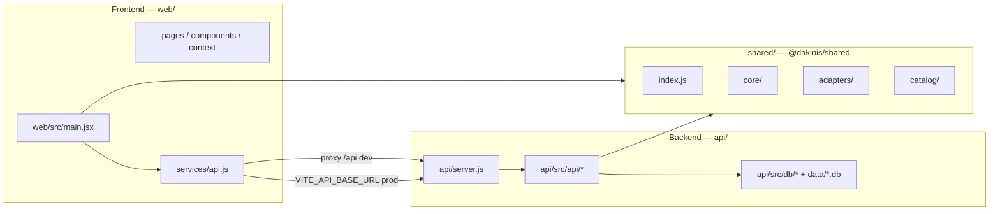

# Dakinis Modular Architecture

Arquitectura del producto **Dakinis One**: motor de modulos reutilizable + personalizacion por vertical + **API multi-tenant** (SQLite en MVP, migrable a PostgreSQL).

El repo esta organizado en **tres carpetas** (`web/`, `api/`, `shared/`) mas **npm workspaces** en la raiz, para poder desplegar el SPA y la API por separado (por ejemplo dos servicios en Render).

## Monorepo y comandos

| Comando | Accion |
|---------|--------|
| `npm run dev` | Vite en `web/` (proxy `/api` → API local). |
| `npm run start:api` | Node: `api/server.js`. |
| `npm run build` | Build de produccion del SPA → `web/dist/`. |
| `npm run lint` / `npm run format` | Raiz: `shared/`, `web/`, `api/`. |

Desarrollo local: **dos terminales** — API (`npm run start:api`) y frontend (`npm run dev`).

## Frontend y backend (mapa)



### Backend (`api/`)

Corre con `npm run start:api` (`node api/server.js` vía workspace). No sirve el SPA.

| Ruta | Rol |
|------|-----|
| `api/server.js` | HTTP: CORS (`CORS_ORIGIN` / `FRONTEND_URL`), rate limit, `/api/*`, auth. |
| `api/src/api/` | REST: `router`, `contracts`, `responses`, `security`, `auth-*`, `business-context`, `adapter-resolver`. |
| `api/src/db/` | SQLite: `schema.sql`, `seed.js`, `index.js`. |
| `data/` | Archivo `dakinis.db` en la raiz del repo (ruta por defecto; ver `SQLITE_PATH`). |

### Frontend (`web/`)

Proyecto Vite + React. Build → `web/dist/`.

| Ruta | Rol |
|------|-----|
| `web/index.html`, `web/styles.css` | Shell y estilos. |
| `web/public/` | Estaticos servidos en `/` (logos, etc.). |
| `web/vite.config.js` | Proxy `/api` (variable opcional `VITE_DEV_API_PROXY`). |
| `web/src/` | `App.jsx`, `pages/`, `components/`, `context/`, `services/api.js`, `data/systemPages.js`, `config/`, `utils/`. |

El cliente HTTP usa `VITE_API_BASE_URL`: **vacío** en local con proxy; en produccion la URL publica del servicio API (sin barra final).

### Paquete compartido (`shared/`)

Paquete **`@dakinis/shared`**: motor (`core/`), adapters, `catalog/`. Lo importan el bundle del navegador y `api/src/api/router.js` / `adapter-resolver.js`.

| Ruta | Rol |
|------|-----|
| `shared/index.js` | `dakinisCreatePlatformModules`, adapters exportados. |
| `shared/core/`, `shared/adapters/`, `shared/catalog/` | Igual que antes bajo `src/`. |

La UI solo (`web/src/config/public-defaults.js`, `web/src/utils/moduleMap.js`) permanece en `web/`.

### Raiz del repo

| Archivo | Rol |
|---------|-----|
| `package.json` | Workspaces `shared`, `web`, `api`. |
| `eslint.config.js`, `.prettierrc.json` | Lint/format sobre los tres paquetes. |
| `.env.example` | Variables para API y build del frontend (Render). |
| `render.yaml` | Blueprint de ejemplo: Static Site + Web Service (API). |

## Principios de diseno

- Configuracion validada (`dakinisValidateConfig`) y modulos con responsabilidad unica.
- Separacion **motor** (`core` + factory) vs **vertical** (`adapters`) vs **tenant** (negocio en DB).
- **Multi-tenant**: `x-business-id`; el tipo de vertical viene de `business.type` en SQLite.
- Credenciales: **JWT** (`POST /api/auth/login`) o **API key** (desarrollo / `tenant_api_keys`).

## Uso rapido (motor en codigo)

```js
import { dakinisCreatePlatformModules, dakinisClinicEstheticAdapter } from "@dakinis/shared";

const modules = dakinisCreatePlatformModules({
  ...dakinisClinicEstheticAdapter,
  dashboard: { currency: "EUR" }
});
```

## API y persistencia

| Pieza | Funcion |
|-------|---------|
| `api/server.js` | Arranca DB, rate limit, tenant, auth. |
| `api/src/api/router.js` | Modulos por `business.type`; `/api/config`, mock-records, etc. |
| `api/src/api/auth-routes.js` | `POST /api/auth/login`, `GET /api/me`. |
| `api/src/db/schema.sql` | Tablas multi-tenant. |

Contrato JSON: `api/src/api/contracts.js` y `responses.js` (`ok`, `data`, `meta`).

## Capas del sistema (lectura rapida)

- **Frontend**: `web/src/*` (sin `shared/`).
- **Dominio compartido**: paquete `@dakinis/shared`.
- **Backend**: `api/server.js`, `api/src/api/*`, `api/src/db/*`, `data/*.db`.

## Despliegue en Render (resumen)

1. **API** (Web Service Node): raiz del repo, `npm ci`, start `npm run start -w @dakinis/api`. Persistencia: disco montado + `SQLITE_PATH`. CORS: `CORS_ORIGIN` = URL del sitio estatico.
2. **Frontend** (Static Site): `npm ci && npm run build -w @dakinis/web`, publicar `web/dist`. En build, definir `VITE_API_BASE_URL` = URL publica de la API.

Detalle en `.env.example` y `render.yaml` (ajustar nombres y planes).

## Calidad de codigo

| Comando | Uso |
|---------|-----|
| `npm run lint` | ESLint (config en raiz). |
| `npm run format` / `format:check` | Prettier. |

Antes de commit o PR: `npm run lint && npm run format:check && npm run build`.

## Referencias

- Producto y roadmap: `ESTRUCTURA.md`.
- Endpoints: `API_READY.md`.
- Variables de entorno: `.env.example`.
