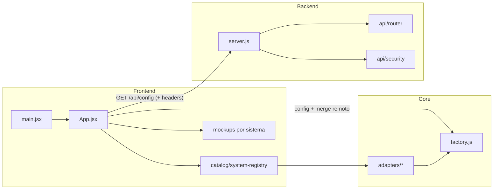

# Dakinis One — Producto, arquitectura y camino hacia SaaS

**Estructura técnica desglosada (frontend vs backend vs capa compartida):** `DAKINIS_ARCHITECTURE.md`.

Este documento une **negocio + producto** con **arquitectura técnica**: qué se construye de verdad, qué existe hoy en el repo y qué falta para un **SaaS multi-tenant vendible**.

---

## Qué estás construyendo (visión)

No es solo un “scheduler con demo”. El objetivo es un **SaaS multi-tenant para negocios**:

- Múltiples **clientes** (cada uno un negocio real con su propio entorno).
- **Datos aislados** por cliente (CRM, agenda, leads, logs).
- **Configuración y facturación** por plan, en el tiempo.
- **Panel** por negocio, no una sola demo que cambia de “tipo”.

La ventaja competitiva no es solo la pila técnica: es **cómo encaja con el flujo real** de clínicas, peluquerías o inmobiliarias.

---

## Estado actual vs objetivo (lectura honesta)

| Aspecto | **Hoy en el repo** | **Objetivo SaaS** |
|--------|---------------------|-------------------|
| Identidad del negocio | Demo por **tipo** (`clinica`, `peluqueria`, `inmobiliaria`) vía URL y `x-business-type`. | **Un negocio = un `business_id`** (UUID o slug único, ej. `clinica_fernandez`). Varios del mismo **tipo** sin compartir datos. |
| Aislamiento de datos | Mockups en **memoria React** (se pierden al recargar). | **PostgreSQL** (u otro) con `business_id` en **todas** las tablas de negocio. |
| API | Clave + `x-business-type` para `/api/config`. | `x-api-key` (o JWT) + **`x-business-id`** en cada request; backend valida que el actor solo accede a su negocio. |
| Autenticación | No hay login de usuario. | Fase posterior: email/password + JWT; usuario ligado a `business_id`. |
| Producto en UI | Páginas verticales + contenido y formularios mock. | Dashboard real: CRUD persistido, agenda, métricas por `business_id`. |

Sin **multi-tenant real** y **persistencia**, el proyecto sigue siendo una **demo técnica potente**; con ellos pasa a ser **producto vendible**.

---

## Multi-tenant (obligatorio para SaaS)

### Qué significa

Cada **cliente** (negocio contratado) tiene su **propio entorno**:

- `business_id` — clave única estable (recomendado: **UUID** en base de datos; opcional **slug** legible para URLs).
- Configuración **independiente** (planes, módulos activos, límites).
- **Datos separados**: la misma app sirve a muchas clínicas; ninguna ve datos de otra.

### Headers orientativos (objetivo)

```http
x-api-key: sk_live_...        # o, con login: Authorization: Bearer <JWT>
x-business-id: <uuid-o-slug>  # identifica el negocio (tenant)
```

Opcionalmente se mantiene un campo de **tipo de vertical** (`type` o `business_type`) como **metadato del negocio** (clínica vs peluquería), no como sustituto del tenant:

- **Mal para SaaS:** “soy `clinica`” como única identidad → todas las clínicas compartirían el mismo contexto.
- **Bien:** “soy `business_id` X y mi `type` es clinica” → muchas clínicas, datos distintos.

### Regla de oro en backend

> **Todas** las consultas de datos de negocio filtran por `business_id`.  
> Nunca confiar solo en el frontend: validar que la clave/JWT tiene derecho a ese `business_id`.

### Qué hace el código hoy (límite)

- Se usa **`x-business-type`** alinear con el **tipo** de vertical de la demo, no con un **cliente** concreto.
- No hay **`x-business-id`** ni persistencia por tenant en la API actual.

Eso está documentado aquí como **deuda explícita** hacia el modelo SaaS anterior.

---

## Persistencia de datos

### Hoy

- Los **mockups** (formularios + tablas) viven en **estado React**: sirven para vender el flujo UX, no son fuente de verdad.
- La API Node actual **no sustituye** una base de datos de producto para esos registros.

### Versión SaaS (objetivo)

Almacenamiento típico (**PostgreSQL**), con **cada fila de negocio** ligada a `business_id`, por ejemplo:

- **business** — id, name, type (vertical), plan, created_at  
- **users** — id, business_id, email, password_hash, role  
- **clients** (pacientes / clientes finales del negocio) — business_id, …  
- **appointments** — business_id, client_id, service, date, status, …  
- **leads** — business_id, pipeline, source, …  
- **messages_log** — business_id, tipo, contenido, sent_at (WhatsApp simulado al inicio, real después)

Cualquier tabla de dominio que se añada debe seguir el mismo patrón: **`business_id` obligatorio**.

---

## Autenticación (futuro; prioridad después de tenant + DB)

### Recomendación de orden

1. **Multi-tenant básico** (`business_id` + datos persistentes y separados).  
2. **CRUD mínimo** usable (clientes, citas).  
3. **Login** cuando haya 2–3 clientes reales y backend guardando datos.

Meter primero roles y permisos sin **clientes reales, persistencia y facturación** es un error común.

### MVP de login (especificación mínima)

- **email + password** → `POST /api/auth/login`.
- Respuesta típica: `{ "token": "<JWT>", "business_id": "<uuid>" }`.
- Frontend guarda token; en cada request:  
  `Authorization: Bearer <token>`  
  y, si el diseño lo requiere, **`x-business-id`** alineado con el token (el servidor **valida coherencia**).

### Tablas mínimas (conceptual)

Ver sección anterior: **business** + **users** con `business_id` y rol inicial (ej. `admin`).

---

## Catálogo de producto vs módulos dinámicos (estrategia)

### Hoy

- Verticales fijas en catálogo: `clinica`, `peluqueria`, `inmobiliaria` + adapters por tipo.

### A medio plazo (más escalable para SaaS)

- El negocio se define como **conjunto de módulos activos**, por ejemplo:  
  `modules: ["agenda", "crm", "whatsapp", "leads"]`  
  más **defaults por `type`** (plantilla inicial para “clínica” vs “inmobiliaria”).
- Reduce el acople “una vertical = una rama de producto”; permite **planes** que encienden/apagan módulos.

Los adapters actuales pueden evolucionar a **presets** que solo rellenan configuración inicial por `business.type`.

---

## Casos de uso (negocio, no solo pantallas)

### Clínica estética

- Gestión de **citas** por cabina / recurso.
- **Recordatorios** y reducción de no-show.
- **Historial** y segmentación de pacientes (VIP, inactivos).

### Peluquería

- **Agenda por profesional** / silla.
- **Reserva online** y reprogramación.
- **Recurrencia y promociones** (fidelización).

### Inmobiliaria

- **Leads** y seguimiento comercial.
- **Visitas** agendadas por propiedad y agente.
- **Embudo** y métricas por agente / fuente.

Estos flujos son los que el **roadmap** debe priorizar en CRUD y pantallas, no solo mockups.

---

## Roadmap técnico (orientado a venta)

| Fase | Contenido |
|------|------------|
| **1 — Actual** | Mockups, rutas por vertical, catálogo + adapters, fábrica de módulos, API base + `/api/config` por tipo. |
| **2** | **PostgreSQL**, modelo `business` + tablas de dominio con **`business_id`**, API que persiste y aísla datos. |
| **3** | **Auth** (JWT), usuario ↔ negocio; panel por cliente. |
| **4** | **Pagos** (ej. Stripe), planes, webhooks, límites por plan. |
| **5** | **WhatsApp** real (Meta), automatizaciones sobre datos ya guardados por tenant. |

**MVP “real” en 2–4 semanas** (orientación): DB + auth básica + clientes + citas + dashboard mínimo + WhatsApp **simulado** con `messages_log`; sin pagos ni IA al inicio.

---

## Arquitectura técnica actual (resumen)

| Capa | Rol |
|------|-----|
| **React + Vite** | SPA: landing, selector de verticales y páginas mock por tipo. |
| **Catálogos (`src/catalog/`)** | Definen verticales y config de producto visible. |
| **Adapters (`src/adapters/`)** | Config por vertical que alimenta la fábrica. |
| **`dakinisCreatePlatformModules`** | Genera módulos (Agenda, Booking, CRM, etc.) desde config fusionado. |
| **`server.js` + `src/api/`** | HTTP mínimo: rate limit, API key, router REST. |



### Deuda estructural (escalado del frontend)

Hoy **`App.jsx` concentra demasiado** (rutas, marketing, mockups, fetch). Para crecer:

```text
src/
  pages/        # Home, SystemPage, Login (futuro)
  components/   # UI reutilizable
  modules/      # Bloques por dominio (agenda, crm, …)
  services/     # apiClient, auth (futuro)
  hooks/        # useBusiness, useConfig, …
```

No es obligatorio refactorizar ya, pero **sí** documentar que el siguiente salto de producto conviene **partir `App.jsx`**.

---

## Arranque y puntos de entrada

| Archivo | Función |
|---------|---------|
| `index.html` | Montaje de la SPA sobre `#root`. |
| `src/main.jsx` | `createRoot` + `styles.css`. |
| `src/App.jsx` | UI principal: rutas manuales, fetch de config, páginas por vertical, mockups. |
| `server.js` | API Node (puerto por defecto `8787`). |

Scripts: `npm run dev`, `npm run start:api`, `npm run build`, `npm run preview`.

---

## Enrutado en el frontend

Sin `react-router`: `currentPath` ↔ `window.location.pathname`, navegación con **`history.pushState`** y `popstate`.

| Ruta | Comportamiento |
|------|----------------|
| `/` | Landing + sistemas disponibles. |
| `/sistema/<clave>` | Página del **tipo** de vertical (`clinica`, `peluqueria`, `inmobiliaria`). |

**Nota SaaS:** en producción coherente con multi-tenant, la URL podría ser algo como `/app/<business_id>` o `/b/<slug>` y el “tipo” sería campo del negocio, no la única clave.

---

## Catálogo de negocios (`src/catalog/`)

### `system-modules.js`

`label` + lista de módulos de marketing por clave vertical.

### `system-registry.js`

Une catálogo + **adapter** (`dakinisAdapterCatalog`). Si falta adapter, el sistema no entra en el registry.

---

## Core: fábrica y adapters

- **`dakinisCreatePlatformModules`**: construye objetos Agenda, Booking, CRM, WhatsApp, Leads, Dashboard desde `config`.
- **Adapters**: presets por vertical.

---

## Configuración remota (`/api/config`) — hoy

```http
GET /api/config
Headers:
  x-api-key: <VITE_API_KEY o fallback>
  x-business-type: <clave del sistema activo en la demo>
```

- Respuesta OK → merge en `remoteConfig` sobre el adapter local.
- Fallo → fallback local y mensaje de error en UI.
- Env cliente: `VITE_API_BASE_URL`, `VITE_API_KEY`.

**Evolución deseada:** mismo endpoint (o `/api/business/:id/config`) con **`x-business-id`** y validación de acceso; `type` como dato del negocio.

---

## Backend actual (`server.js`, `src/api/`)

- **Rate limit** → **API key** → **router**.
- **`src/api/security.js`**: claves vía `DAKINIS_API_KEYS` o archivo; `/api/health` con reglas propias.
- **`src/api/router.js`**: rutas REST preparadas; el frontend MVP usa sobre todo **config**.

---

## Páginas por vertical (contenido en `App.jsx`)

| Bloque | Descripción |
|--------|-------------|
| `DAKINIS_SYSTEM_PAGE_CONTENT` | Copy + KPIs/workflow mock por vertical. |
| `DAKINIS_SYSTEM_MOCKUPS` | Formulario + tabla en memoria (no persistido). |
| Mapa de funciones | Por módulo, desde la fábrica. |
| JSON de config | Merge local + API. |

Mockups: **aislados por clave de vertical** en el estado React (no por `business_id` real).

---

## Estilos

- **`styles.css`**: tema + hero, cards, KPIs, formularios y tablas mock.

---

## Flujo típico hoy (demo)

1. Usuario en `/` elige vertical → `/sistema/clinica` (ejemplo).
2. Se deriva `activeSystemKey` de la URL → copy + mockups de esa vertical.
3. `useEffect` llama `/api/config` con `x-business-type` → enriquece `modules.config` si la API responde.
4. La fábrica genera módulos; la UI muestra funciones + JSON + bloque API.

---

## Próximo paso estratégico (resumen)

1. **Modelar `business` + `business_id` en API y base de datos.**  
2. **Sustituir mock en memoria** por CRUD persistido con filtro por tenant.  
3. **Headers y autorización** acordes (`x-business-id` + validación).  
4. **Auth JWT** cuando el producto ya guarda datos de clientes reales.  
5. **Refactor de carpetas** y, a medio plazo, **módulos activables** por plan, no solo verticales fijas.

Este archivo debe actualizarse cuando se implemente multi-tenant o auth: la documentación de producto y la del código deben **seguir alineadas**.
